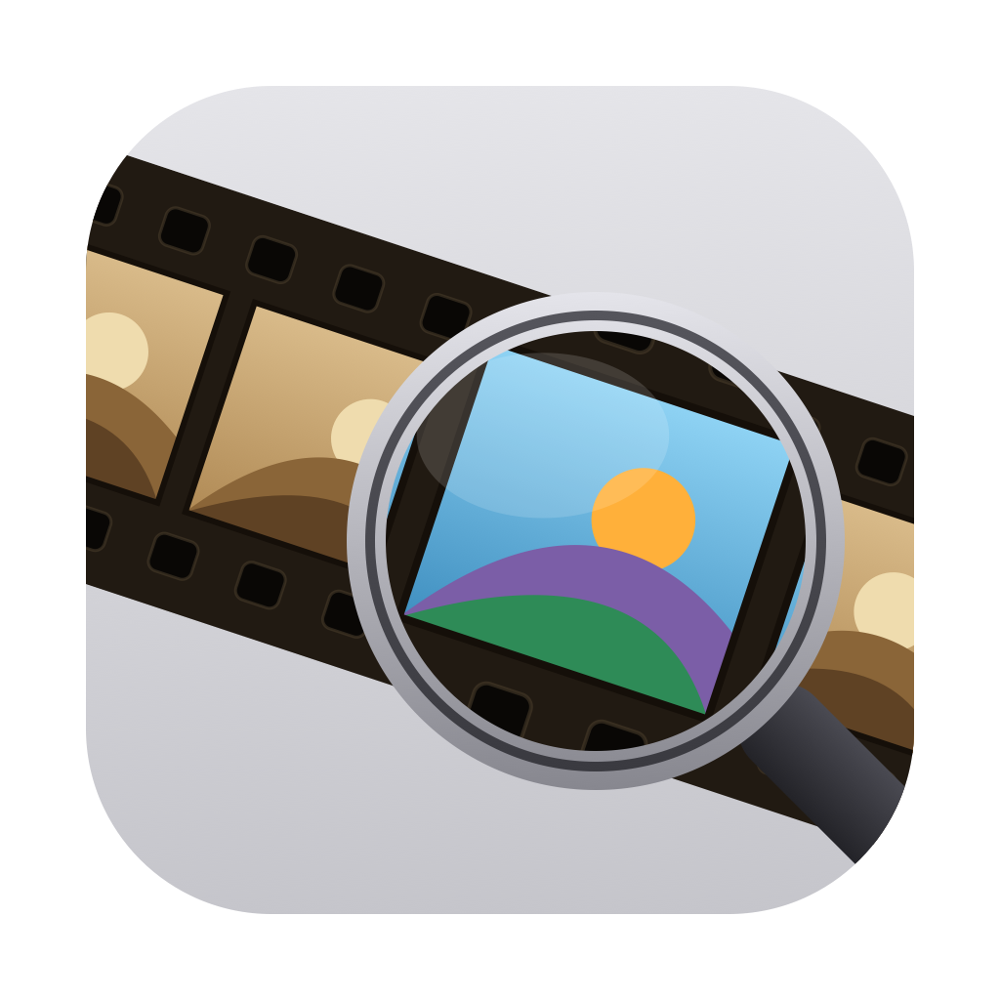
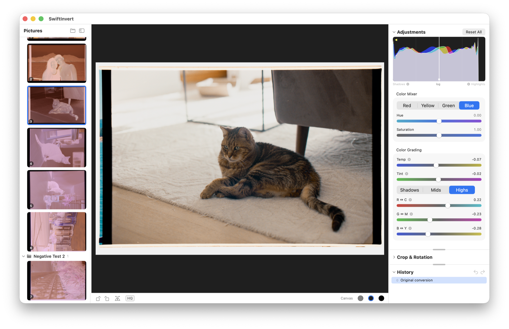

<p align="center">
  
</p>

# SwiftInvert

A native macOS film-negative converter — a Swift + SwiftUI + Metal rewrite of
[NegPy](../NegPy)'s C-41 conversion, no Python at runtime. Browse a folder of
camera-scanned negatives, invert with NegPy-quality auto-exposure metering,
refine with darkroom-style controls, and batch-export.



## Build & run

```bash
brew install libraw    # one-time; the only dependency
./build.sh && open dist/SwiftInvert.app
```

Or `make install` to build and copy it to `/Applications`. The bundle is
self-contained (the LibRaw dylibs are copied in), so the installed app keeps
working across brew upgrades. Requires macOS 14+ and a Swift 6 toolchain —
Command Line Tools are enough, no Xcode; Metal shaders compile at runtime.

## Features

- Folder-tree library with film-strip previews; multi-select batch export
  (JPEG/TIFF, sRGB by default) with progress and cancel
- C-41 inversion with automatic exposure and contrast metering, plus a live
  histogram with draggable white/black-point handles
- Darkroom print controls (brightness, grade, toe/shoulder, True Black) and
  regional tone controls (shadows/highlights and their contrasts)
- Color tools: temp/tint, per-band color grading, a chroma-gated Color Mixer
  (R/Y/G/B hue + saturation that never moves neutrals), vibrance/saturation
- Crop, rotate/flip, live straighten with composition guides; per-image
  undo/redo history; copy/paste adjustments; HQ full-resolution preview

## Development

```bash
swift run -c release SwiftInvert   # run from source (debug decode is ~10x slower)
make test                   # parity tests against NegPy-dumped fixtures (not bare `swift test`)
.build/release/negcli       # headless pipeline driver (decode/thumb/render/bench)
```

## Architecture

- `NegativeKit` — pure Swift port of NegPy's conversion kernel: log-density
  analysis, auto-exposure metering, print-curve parameter derivation.
  Ported from `negpy/features/exposure/{normalization,logic,models}.py`.
- `MetalRenderKit` — the per-pixel render chain (normalization → H&D print
  curve → color pop → ProPhoto ROMM encode → histogram), ported from NegPy's
  WGSL shaders.
- `RawDecodeKit` — LibRaw wrapper matching NegPy's rawpy decode parameters
  (linear sensor-native decode, unity WB, EXIF orientation baked after).
- `SwiftInvert` — the SwiftUI app. `negcli` — headless CLI for verification.

## Parity fixtures

`Tests/Fixtures/` is dumped from the NegPy reference implementation by
`scripts/dump_fixtures.py` (run inside NegPy's environment; see the script
docstring). Swift tests verify each stage boundary against them.

## License

SwiftInvert is licensed under the [GNU General Public License v3.0](LICENSE).
LibRaw is used under its LGPL-2.1 option via dynamic linking (LGPL-2.1 §3
permits GPL conversion, making it GPL-3.0-compatible).
